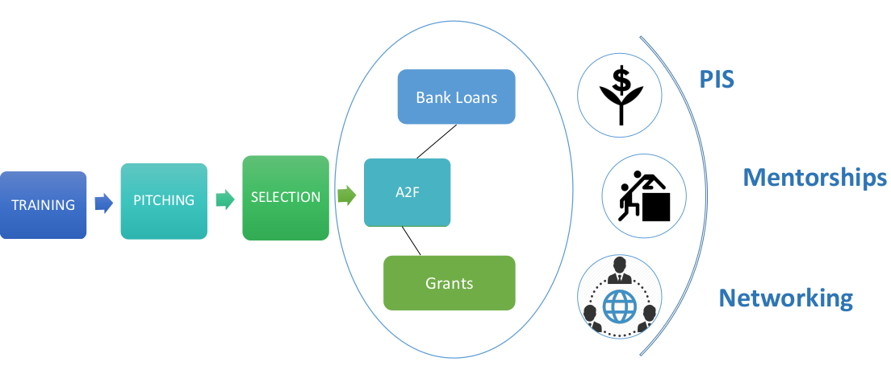

Social Entrepreneurship can tackle major social issues and offer new ideas for wide-scale change. Rather than leaving societal needs to the government or business sectors, social entrepreneurs find what is not working and solve the problem by changing the system, spreading the solution, and persuading entire societies to take new leaps.

We support social entrepreneur’s individuals or teams with innovative solutions to society’s most pressing social problems, with personal ambition and persistent, to provide them with a platform to connect, grow and reach their markets, while in the process creating new jobs and contributing to the economy.

The youth, who make up roughly 30 percent of the countries total population, have struggled with social and economic exclusion, facing poor outcomes and institutional barriers as they move from school to work and from work to family formation.
