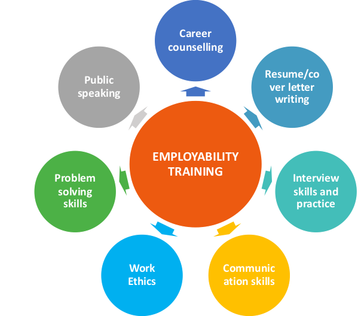

<!--  -->

Ethiopia's youthful population is an incredible asset and untapped resource for positive growth. Of Ethiopia's population, estimated at 104 million, 41 percent is under the age of 15. More than 28 percent is aged 15 to 29. Youth unemployment is estimated at nearly 27 percent.

We design, develop and implement innovative solutions and programs that can create opportunities for youth and can increase their employability, Training youth on 21st century skills increase.
